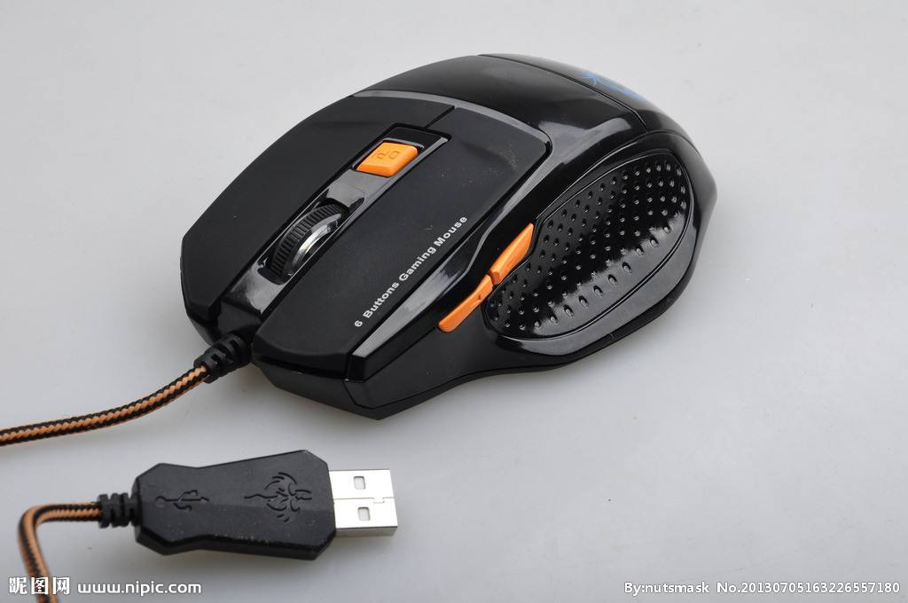

# usbmouse

## 鼠标数据格式解析 (网上查询到的)

```Text

鼠标发送给PC的数据每次4个字节
BYTE1 BYTE2 BYTE3 BYTE4
定义分别是：
BYTE1 --
       |--bit7:   1   表示   Y   坐标的变化量超出－256   ~   255的范围,0表示没有溢出  
       |--bit6:   1   表示   X   坐标的变化量超出－256   ~   255的范围，0表示没有溢出  
       |--bit5:   Y   坐标变化的符号位，1表示负数，即鼠标向下移动  
       |--bit4:   X   坐标变化的符号位，1表示负数，即鼠标向左移动  
       |--bit3:     恒为1  
       |--bit2:     1表示中键按下  
       |--bit1:     1表示右键按下  
       |--bit0:     1表示左键按下  
BYTE2 -- X坐标变化量，与byte的bit4组成9位符号数,负数表示向左移，正数表右移。用补码表示变化量  
BYTE3 -- Y坐标变化量，与byte的bit5组成9位符号数，负数表示向下移，正数表上移。用补码表示变化量
BYTE4 -- 滚轮变化。
```

## 本人使用鼠标的数据格式，（和上面有些出入）

* 

```Text
鼠标发送给PC的数据每次7个字节
BYTE1 BYTE2 BYTE3 BYTE4 BYTE5 BYTE6 BYTE7
定义分别是：
BYTE1 --
       |--bit7:
       |--bit6:
       |--bit5:
       |--bit4:     1表示右边上按键
       |--bit3:     1表示右边下按键
       |--bit2:     1表示中键按下  
       |--bit1:     1表示右键按下  
       |--bit0:     1表示左键按下  
BYTE3 BYTE2 -- X坐标变化量：带符号short, 负数表示向下移，正数表上移
BYTE5 BYTE4 -- Y坐标变化量：带符号short, 负数表示向下移，正数表上移
BYTE6 -- 滚轮变化量：带符号char, 负数表示向下移，正数表上移
BYTE7
```

## 编译

* make

## 参数介绍

```C
xxx@xxx-pc:~/WorkSpaces/USBStudy/3_usbmouse$ sudo ./usbmouse -h
usage: libusb-test [-v idVendor] [-p idProduct] [-h] 
   -h      : display usage
   -m      : 显示模式,(0:显示原始数据， 1:显示解析数据)
   -v      : 默认设备的VID
   -p      : 默认设备的PID
```

## 执行结果

## 打印原始数据

```Shell
    xxx@xxx-pc:~/WorkSpaces/USBStudy/3_usbmouse$ sudo ./usbmouse 
    Success to register usb arrived callback
    Success to register usb left callback
    usb_monitor_thread creation Success
    : Success
    Device(idVendor=2362, idProduct=9505) Opened
    Kernel Driver Active
    usb monitor thread started.
    Kernel Driver Detached!
    Claimed Interface
    size:7 : data:00 03 00 00 00 00 00 
    size:7 : data:00 02 00 00 00 00 00
    size:7 : data:00 03 00 00 00 00 00 
    size:7 : data:00 ff ff 00 00 00 00 
    LEFT: usb device removed: 093a:2521
    interrupt ep rev faild, err: LIBUSB_ERROR_NO_DEVICE
    ADD: usb device attached: 093a:2521
    kernel driver active
    kernel driver detach
    libusb_claim_interface Success
    size:7 : data:00 1a 00 01 00 00 00 
    size:7 : data:00 fe ff 00 00 00 00 
    size:7 : data:00 ff ff 00 00 00 00 
    size:7 : data:00 ff ff 00 00 00 00 
    ^C收到退出信号，等待main退出
    size:7 : data:00 fd ff 00 00 00 00 
    Released Interface
    收到退出信号，等待thread退出
    thread收到退出信号，完成退出
    main收到退出信号，完成退出
```

* 鼠标事件
  
```C
    size:7 : data:00 02 00 00 00 00 00
```

* 拔插鼠标的打印

```C
    size:7 : data:00 ff ff 00 00 00 00 
    LEFT: usb device removed: 093a:2521
    interrupt ep rev faild, err: LIBUSB_ERROR_NO_DEVICE
    ADD: usb device attached: 093a:2521
    kernel driver active
    kernel driver detach
    libusb_claim_interface Success
    size:7 : data:00 1a 00 01 00 00 00 
```

## 打印解析数据

```C
xxx@xxx-pc:~/WorkSpaces/USBStudy/3_usbmouse$ sudo ./usbmouse -m 1
打印获取鼠标的<解析数据> x,y出事坐标为(0,0)
Success to register usb arrived callback
Success to register usb left callback
usb_monitor_thread creation Success
: Success
usb monitor thread started.
Device(idVendor=2362, idProduct=9505) Opened
Kernel Driver Active
Kernel Driver Detached!
Claimed Interface
size:7 : 	左:松开	右:松开	中:松开	左下:松开	左上:松开	x:1	y:0	滚轮:0 	x=1,y=0
size:7 : 	左:松开	右:松开	中:松开	左下:松开	左上:松开	x:2	y:0	滚轮:0 	x=3,y=0
size:7 : 	左:松开	右:松开	中:松开	左下:松开	左上:松开	x:2	y:0	滚轮:0 	x=5,y=0
size:7 : 	左:松开	右:松开	中:松开	左下:松开	左上:松开	x:2	y:0	滚轮:0 	x=7,y=0
size:7 : 	左:松开	右:松开	中:松开	左下:松开	左上:松开	x:4	y:0	滚轮:0 	x=11,y=0
size:7 : 	左:松开	右:松开	中:松开	左下:松开	左上:松开	x:4	y:0	滚轮:0 	x=15,y=0
size:7 : 	左:松开	右:松开	中:松开	左下:松开	左上:松开	x:5	y:0	滚轮:0 	x=20,y=0
size:7 : 	左:松开	右:松开	中:松开	左下:松开	左上:松开	x:5	y:2	滚轮:0 	x=25,y=2
size:7 : 	左:松开	右:松开	中:松开	左下:松开	左上:松开	x:3	y:1	滚轮:0 	x=28,y=3
size:7 : 	左:松开	右:松开	中:松开	左下:松开	左上:松开	x:5	y:1	滚轮:0 	x=33,y=4
size:7 : 	左:松开	右:松开	中:松开	左下:松开	左上:松开	x:4	y:0	滚轮:0 	x=37,y=4
size:7 : 	左:松开	右:松开	中:松开	左下:松开	左上:松开	x:5	y:1	滚轮:0 	x=42,y=5
size:7 : 	左:松开	右:松开	中:松开	左下:松开	左上:松开	x:5	y:1	滚轮:0 	x=47,y=6
size:7 : 	左:松开	右:松开	中:松开	左下:松开	左上:松开	x:4	y:0	滚轮:0 	x=51,y=6
size:7 : 	左:松开	右:松开	中:松开	左下:松开	左上:松开	x:4	y:0	滚轮:0 	x=55,y=6
size:7 : 	左:松开	右:松开	中:松开	左下:松开	左上:松开	x:3	y:0	滚轮:0 	x=58,y=6
size:7 : 	左:松开	右:松开	中:松开	左下:松开	左上:松开	x:3	y:1	滚轮:0 	x=61,y=7
size:7 : 	左:松开	右:松开	中:松开	左下:松开	左上:松开	x:1	y:1	滚轮:0 	x=62,y=8
size:7 : 	左:松开	右:松开	中:松开	左下:松开	左上:松开	x:1	y:0	滚轮:0 	x=63,y=8
^C收到退出信号，等待main退出
size:7 : 	左:松开	右:松开	中:松开	左下:松开	左上:松开	x:1	y:-1	滚轮:0 	x=64,y=7
Released Interface
收到退出信号，等待thread退出
thread收到退出信号，完成退出
main收到退出信号，完成退出
```